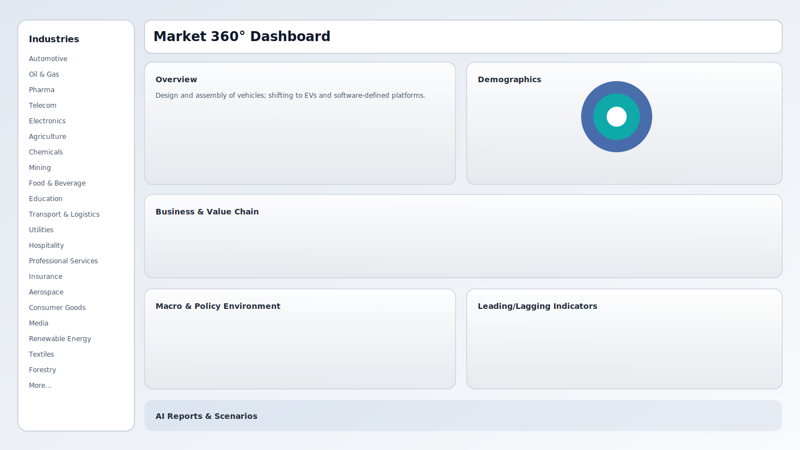

# Market 360° – AI-Powered Industry Intelligence Dashboard

## Setup
1. Install dependencies:
   ```bash
   npm install
   ```
2. Run the dev server:
   ```bash
   npm run dev
   ```
3. Open http://localhost:3000.

## OpenRouter configuration
- Click **AI Reports & Scenarios** panel.
- Enter your OpenRouter API key, optional base URL, and model string (e.g., `anthropic/claude-3.5-sonnet`). Use the IDs listed in your OpenRouter dashboard.
- Keys are stored only in your browser localStorage.

## Preview


## Stack
- Next.js + React + TypeScript
- Tailwind CSS for UI
- Recharts for charts
- Local JSON data under `/data` (extend as needed).
